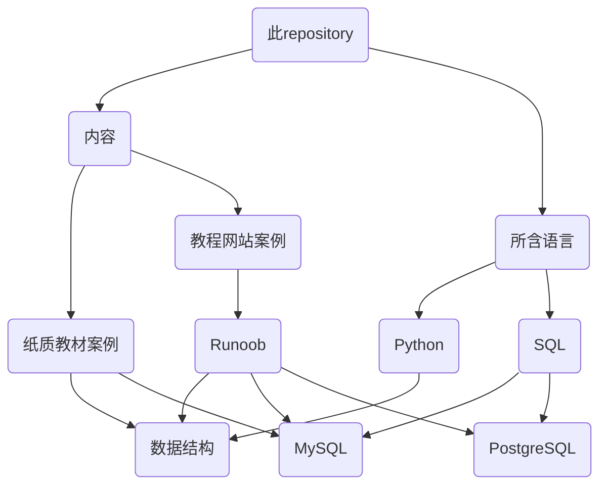

# code-learning

   编程案例学习工作区

```mermaid
graph TD
rt(此repository) --> l1(内容)
%% rt --> l2(文件命名方法)
rt --> l3(所含语言)

l1 --> l11(纸质教材案例)
l1 --> l12(教程网站案例)

l11 --> l111(数据结构)
l11 --> l112(MySQL)

l12 --> l121(Runoob)

l3 --> l31(Python)
l3 --> l32(SQL)

l121 & l31 --> l111
l121 & l32 --> l112
l121 & l32 --> l1212(PostgreSQL)
```

  

